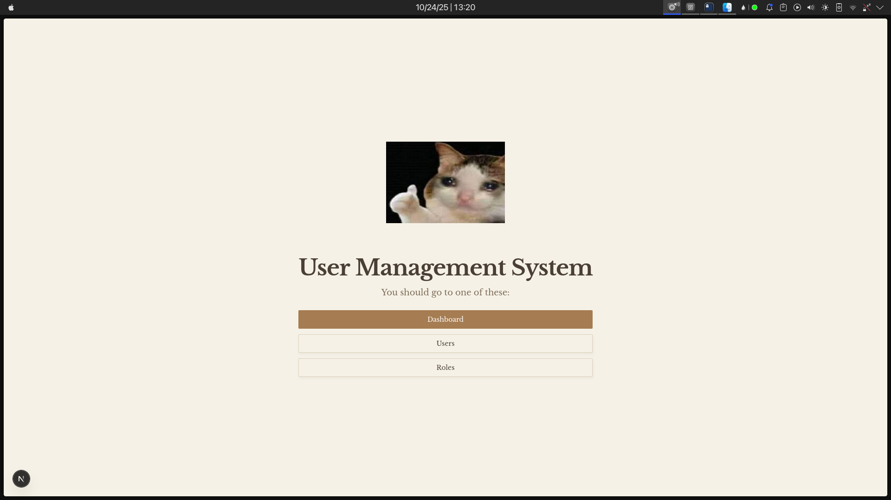
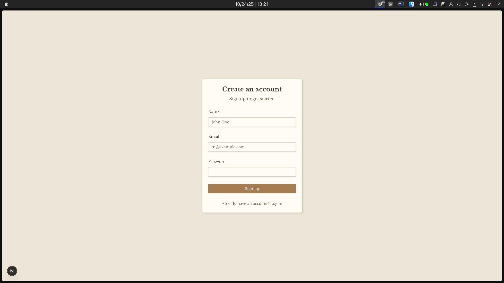
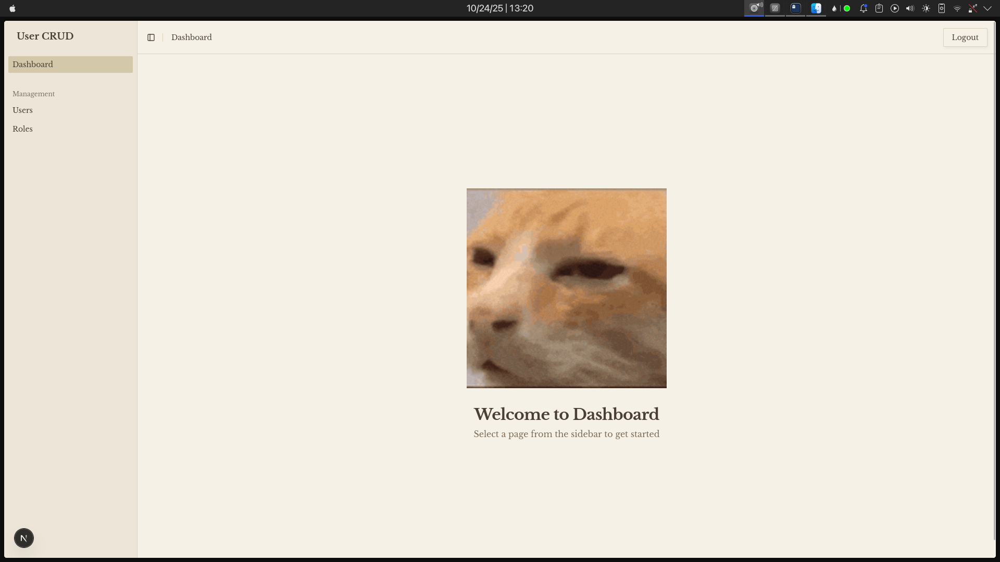
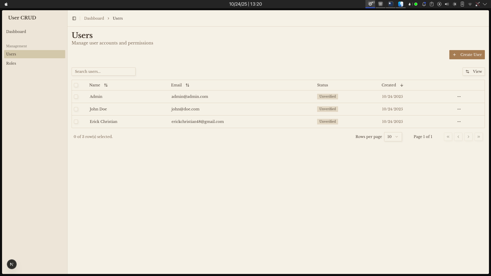
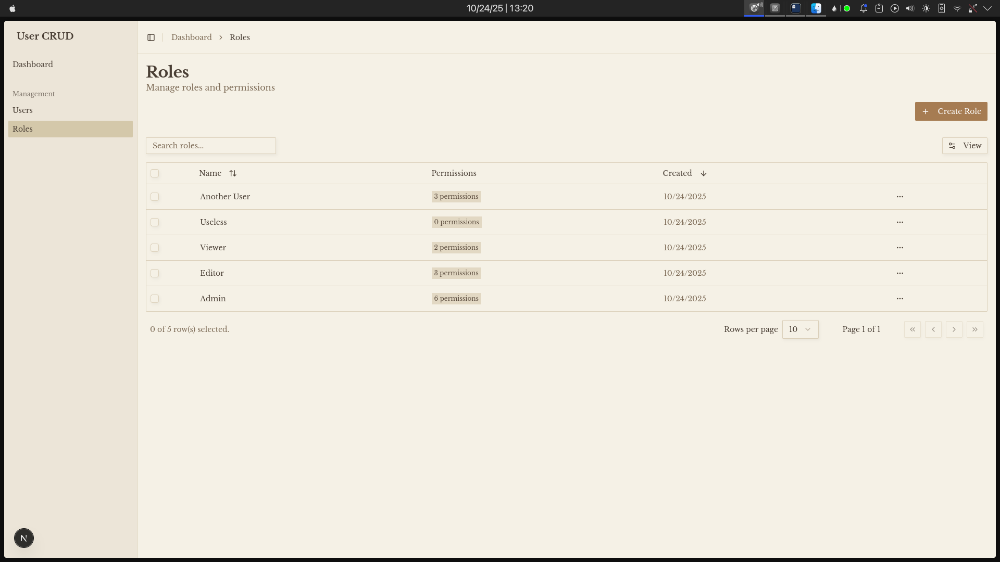

# User Management System

A full-stack user management system built with Next.js, featuring role-based access control, authentication, and a complete CRUD API with OpenAPI documentation.



## Features

- **Authentication**: Email/password authentication with Better Auth
- **Role Management**: Complete CRUD operations for roles with permission management
- **User Management**: Full user CRUD with multi-role assignment
- **API Documentation**: Auto-generated OpenAPI/Swagger documentation
- **Modern UI**: Built with shadcn/ui and Tailwind CSS
- **Server Components**: Optimized with React Server Components
- **Data Fetching**: TanStack Query for efficient client-side state management

## Tech Stack

- **Framework**: Next.js 15 (App Router)
- **Database**: Turso (LibSQL) / SQLite
- **ORM**: Drizzle
- **Auth**: Better Auth
- **API**: Hono with OpenAPI
- **UI**: shadcn/ui + Tailwind CSS
- **State Management**: TanStack Query
- **Runtime**: Bun

## Setup

### 1. Clone the repository

```bash
git clone https://github.com/ericc-ch/user-crud.git
cd user-crud
```

### 2. Install dependencies

```bash
bun install
```

### 3. Configure Database

You have two options:

#### Option A: Use Turso (Recommended for Production)

1. Create a Turso database: https://turso.tech
2. Copy `.env.example` to `.env`:
```bash
cp .env.example .env
```
3. Fill in your Turso credentials:
```env
TURSO_DATABASE_URL=your_database_url
TURSO_AUTH_TOKEN=your_auth_token
BETTER_AUTH_SECRET=your_secret_key
BETTER_AUTH_URL=http://localhost:3000
```

#### Option B: Use Local SQLite

1. Modify `lib/db.ts`:
```typescript
import { schema } from "@/schemas/main";
import { drizzle } from "drizzle-orm/better-sqlite3";
import Database from "better-sqlite3";

const sqlite = new Database("local.db");
export const db = drizzle(sqlite, { schema });
```

2. Update `.env`:
```env
BETTER_AUTH_SECRET=your_secret_key
BETTER_AUTH_URL=http://localhost:3000
```

### 4. Push database schema

```bash
bun run db:push
```

### 5. Seed the database (optional)

```bash
bun run scripts/seed.ts
```

### 6. Start the development server

```bash
bun run dev
```

Visit http://localhost:3000

## API Documentation

### Swagger UI
Access interactive API documentation at: **http://localhost:3000/api/swagger**

### OpenAPI Spec
Get the raw OpenAPI specification at: **http://localhost:3000/api/doc**

### API Endpoints

#### Authentication (Better Auth)
- `POST /api/auth/sign-up/email` - Sign up with email/password
- `POST /api/auth/sign-in/email` - Sign in with email/password
- `POST /api/auth/sign-out` - Sign out
- `GET /api/auth/get-session` - Get current session

#### Users
- `GET /api/users` - List users (pagination, search, sort)
- `GET /api/users/:id` - Get user by ID
- `POST /api/users` - Create new user
- `PUT /api/users/:id` - Update user
- `DELETE /api/users/:id` - Delete user

#### Roles
- `GET /api/roles` - List roles (pagination, search, sort)
- `GET /api/roles/:id` - Get role by ID
- `POST /api/roles` - Create new role
- `PUT /api/roles/:id` - Update role
- `DELETE /api/roles/:id` - Delete role

## Frontend Routes

- `/` - Landing page (public)
- `/auth/signin` - Sign in page
- `/auth/signup` - Sign up page
- `/app` - Dashboard (protected)
- `/app/users` - User management (protected)
- `/app/roles` - Role management (protected)

## Screenshots

### Landing Page


### Sign Up


### Dashboard


### User Management


### Role Management


## Project Structure

```
.
├── app/                    # Next.js app directory
│   ├── api/               # API route handlers
│   ├── app/               # Protected app routes
│   │   ├── users/        # User management pages
│   │   └── roles/        # Role management pages
│   ├── auth/              # Authentication pages
│   └── page.tsx           # Landing page
├── backend/               # API implementation
│   ├── routes/           # API route definitions
│   └── middleware/       # Auth middleware
├── components/            # React components
│   ├── ui/               # shadcn/ui components
│   └── data-table/       # Reusable table components
├── lib/                   # Utilities
│   ├── queries/          # TanStack Query factories
│   ├── auth.ts           # Better Auth config
│   └── db.ts             # Database connection
└── schemas/               # Drizzle schemas
```
